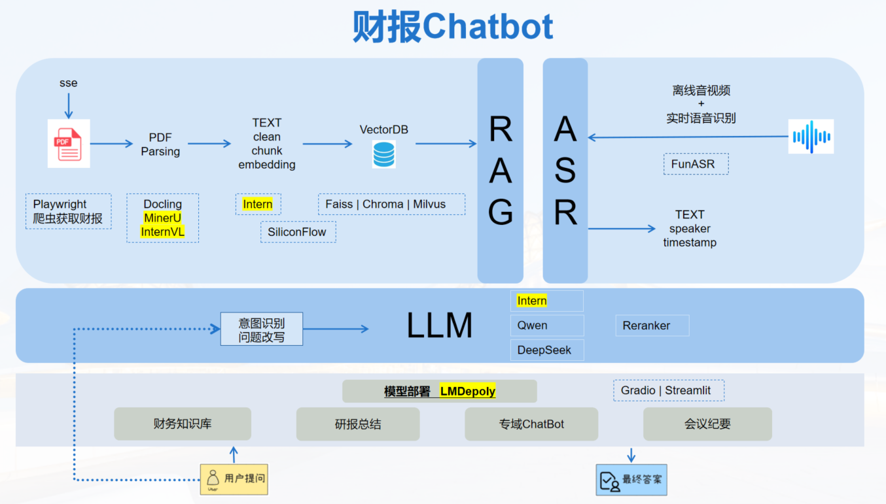

# FRA-RAG
使用书生Intern大模型，以快速处理财报为RAG，高精度问答

## 🗂️ 目录
- [前言](#前言)
- [技术架构](#技术架构)
- [使用指南](#使用指南)
    - [文档结构](#文件结构)
    - [环境准备](#环境准备)
    - [PDF处理](#PDF处理)
    - [问题集](#问题集)
    - [RAG(检索增强生成)](#rag检索增强生成)
    - [ASR(语音识别)](#ASR(语音识别))
- [开发计划](#开发计划)
    - [初版功能](#初版功能)
- [致谢](#致谢)
- [免责声明](#免责声明)


## 前言

在当今瞬息万变的金融市场中，投资决策的复杂性与日俱增。随着信息量的激增和市场环境的不断变化，大量金融财报数据投资信息难以快速查找、了解。因此，构建一个金融报告RAG对金融机构日常工作非常重要非常迫切。

## 技术架构



构建**金融领域模型**,使用Internlm2-chat-7b 💥部署集成了LMDeploy加速推理 🚀，支持 RAG 检索增强生成 💾，为金融领域大模型提供丰富的知识库组。

### RAG技术

目前支持Doc、Docx、Excel、csv、PDF、MD文件。

主要针对PDF研报年报文件，本项目通过使用MinerU将pdf文件转换成markdown结构化格式。

最终输出的结构化数据，通过bge-m3模型Embedding到Faiss向量数据库。

### ASR技术
支持 离线、实时音视频转录、会议纪要功能。

## 使用指南

### 文件结构

```bash
FRA-RAG/
│
├── assets                   # 素材
├── data                     # 数据（PDF报告、企业PDF对应表、公司别名映射文件、问题文件、结果文件）
├── audio                    # 音视频文件
├── deploy                   # 发布
├── src                      # 项目代码
├── tools                    # 工具类
├── .env                     # 环境配置
├── README.md                # README.md
└── requirements.txt         # 使用pip安装的依赖
```

### 环境准备

```shell
# 创建虚拟环境
conda create -n invest python=3.10 -y

# 激活虚拟环境（注意：后续的所有操作都需要在这个虚拟环境中进行）
conda activate invest

# 安装一些必要的库
conda install pytorch==2.1.2 torchvision==0.16.2 torchaudio==2.1.2 pytorch-cuda=12.1 -c pytorch -c nvidia -y
# 安装其他依赖
pip install -r requirements.txt
```


### PDF处理

1. 从上交所获取股票年报：`handle_ssc.py`
2. 年报PDF哈希处理，以哈希值命名PDF，确保唯一性：`doc_hash_id.py`
3. hashID与公司名称对应关系以及元数据信息写入subset.csv文件：`doc_hash_id.py`

### 问题集
问题json必须包含 问题文本text、问题类型kind。

其中，kind分为四类：name, names, number, boolean。按问题所问内容和预期回答数据的类型选择其一。

### RAG(检索增强生成)

默认`data`目录为数据源目录，
1. 解析，使用MinerU解析PDF文件、文本清洗；
2. 存储，使用bge-m3模型将`data`目录下的年报数据向量化，并按文件分别存储Faiss向量库数据；
3. 检索，使用Faiss向量检索和InternLM模型重排序的混合检索模式，找到相关段落，并溯源父页面索引；
4. 生成，问题意图识别和改写，构建提示词和预期响应格式示例，把相关父页面作为上下文，输入InternLM模型进行推理问答，并格式化输出。

### ASR(语音识别)
采用FunASR paraformer-zh模型作为主语音识别模型、InternLM模型/deepseek-V3模型作为后续识别文本的整理纪要生成模型。


 
## 开发计划

### 初版功能

- [x] 收录并解析各渠道数据

- [x] 使用RAG支持财报、研报，搭建知识库

- [x] 加入语音多模态，如ASR（用户语音输入）

- [x] 基于OpenXLab使用LMDepoly实现初版demo部署


## 致谢

非常感谢以下这些开源项目给予我们的帮助：

- [InternLM](https://github.com/InternLM/InternLM)
- [Imdeploy](https://github.com/InternLM/lmdeploy)
- [InternlM-Tutorial](https://github.com/InternLM/Tutorial)
- [Streamer-Sales](https://github.com/PeterH0323/Streamer-Sales)

最后感谢上海人工智能实验室推出的书生·浦语大模型实战营，为我们的项目提供宝贵的技术指导和强大的算力支持！

## 免责声明

**本项目相关资源仅供学术研究之用，严禁用于商业用途。** 使用涉及第三方代码的部分时，请严格遵循相应的开源协议。模型生成的内容受模型计算、随机性和量化精度损失等因素影响，本项目不对其准确性作出保证。对于模型输出的任何内容，本项目不承担任何法律责任，亦不对因使用相关资源和输出结果而可能产生的任何损失承担责任。本项目由个人及协作者业余时间发起并维护，因此无法保证能及时回复解决相应问题。